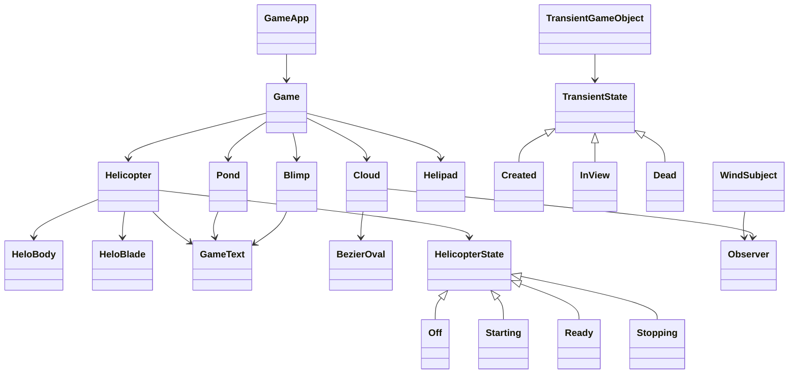

# RainMaker 🌧️🚁

RainMaker is a dynamic, interactive 2D helicopter simulation game built with Java and JavaFX. Players control a helicopter to seed clouds and fill ponds with water, while managing fuel and navigating obstacles. The game combines procedural graphics, state-based behavior, and real-time physics for an engaging, educational experience.

---

## Table of Contents

- [Gameplay Overview](#gameplay-overview)  
- [Features](#features)  
- [Architecture & Design](#architecture--design)  
- [Controls](#controls)  
- [Setup & Running](#setup--running)  
- [Audio & Graphics](#audio--graphics)  
- [Potential Enhancements](#potential-enhancements)  
- [License](#license)  

---

## Gameplay Overview

In RainMaker, the player pilots a helicopter to seed clouds and fill ponds across the landscape. The goal is to achieve **100% water in each pond** before fuel runs out.  

Key gameplay mechanics:  

- **Helicopter Control:** Start/stop engines, move in all directions, rotate heading.  
- **Cloud Seeding:** Fly over clouds and activate seeding to increase pond water levels.  
- **Fuel Management:** Refuel via blimps appearing randomly.  
- **Environmental Simulation:** Clouds move with wind; procedural graphics create realistic cloud shapes.  
- **Win/Loss Conditions:** Win by filling all ponds; lose if fuel runs out.  

---

## Features

- **Procedural Clouds:** Bezier curves form dynamic, realistic cloud shapes.  
- **Fuel & Refueling:** Helicopter consumes fuel, can refill via blimps.  
- **Wind Simulation:** Observer pattern dynamically updates cloud movement based on wind speed.  
- **State-Driven Helicopter:** Helicopter behavior (Off, Starting, Ready, Stopping) uses the State design pattern.  
- **Transient Objects:** Clouds and blimps follow life-cycle states (`Created`, `InView`, `Dead`).  
- **Interactive UI:** Real-time updates of fuel, cloud seed percentage, and pond water level.  
- **Audio Effects:** Engine, seeding, and blimp sounds enhance immersion.  
- **Collision & Distance Logic:** Determines when clouds affect pond water levels.  

---

## Design Patterns

State Pattern: HelicopterState (Off, Starting, Ready, Stopping) and TransientState (Created, InView, Dead) manage object behavior dynamically.

Observer Pattern: WindSubject notifies registered Cloud observers of wind speed changes.

## Architecture & Design

RainMaker leverages **object-oriented principles** and **design patterns**:

### Visual Architecture

---

## Game Objects

- Helicopter: Combines HeloBody and HeloBlade, state-driven behavior, fuel management.

- Cloud: Procedurally generated with BezierOval; seeds ponds; observes wind.

- Pond: Tracks water percentage; visually scales as water fills.

- Helipad: Starting point for helicopter ignition.

- Blimp: Transient objects for refueling, appear randomly.

## Controls

| Key | Action |
|-----|-------|
| ↑   | Increase speed / move forward |
| ↓   | Decrease speed / move backward |
| ←   | Rotate helicopter left |
| →   | Rotate helicopter right |
| I   | Toggle helicopter ignition (start/stop) |
| SPACE | Seed cloud when above it |
| R   | Reset game |
| B   | Toggle collision bounds visibility (debug) |

---
